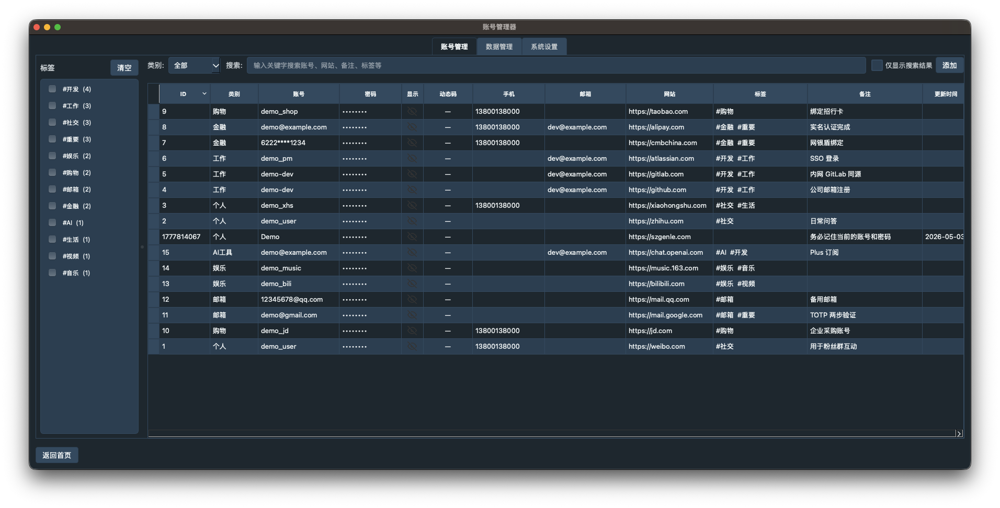
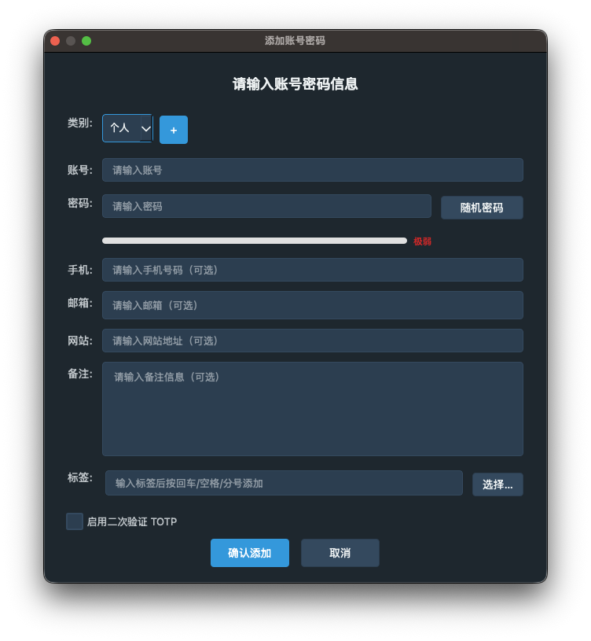
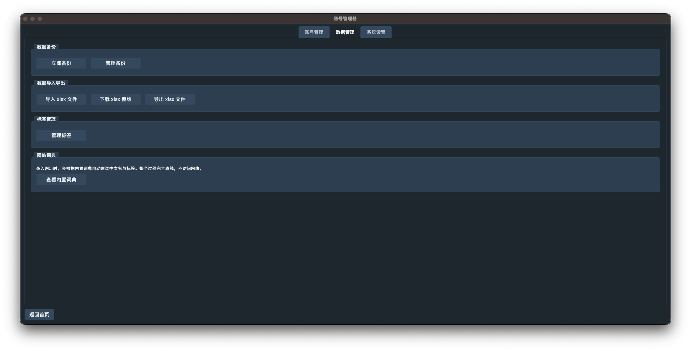
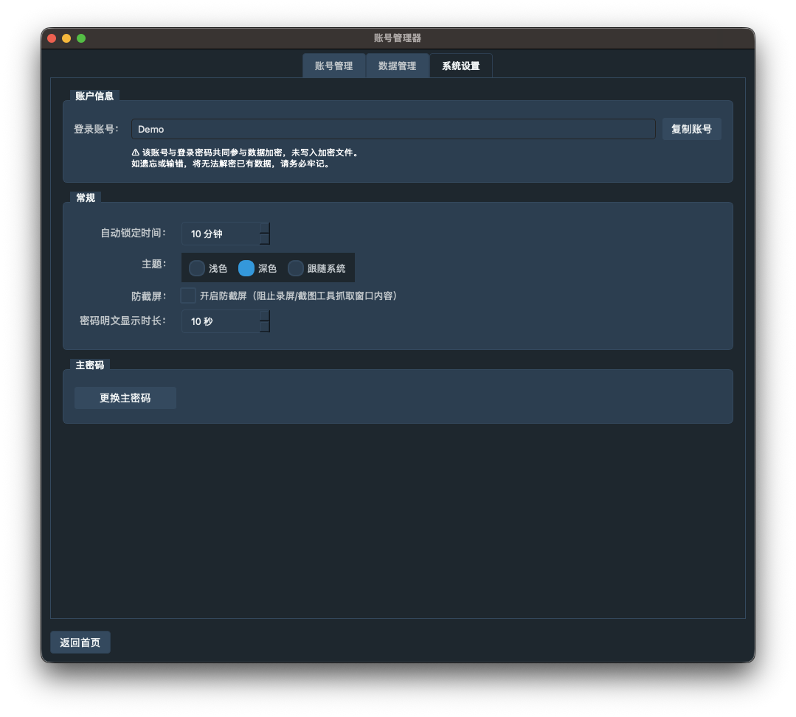
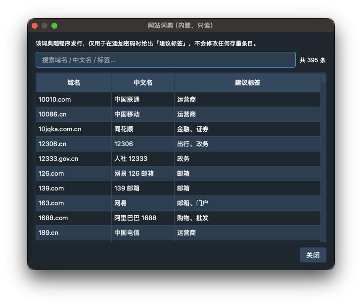
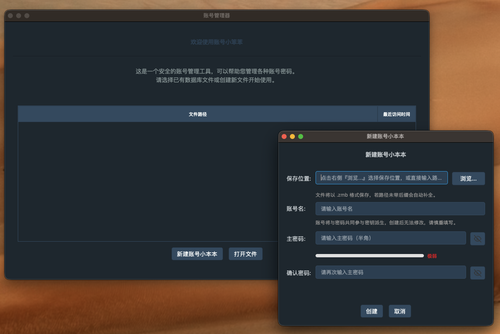
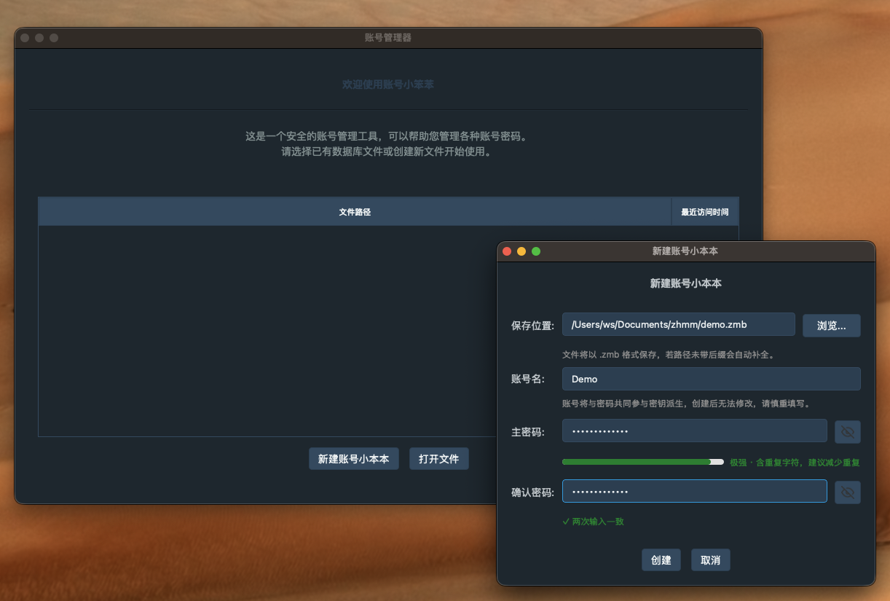

<h1 align="center">🔐 zhmm</h1>

<p align="center">
  基于 <b>国密算法（SM3 / SM4）</b> 的本地优先账号密码管理器<br/>
  支持 PyQt6 图形界面与命令行两种形态，单文件密库，开箱即用。
</p>

<p align="center">
  <a href="https://github.com/szgenle/zhmm/actions"></a>
  <a href="https://github.com/szgenle/zhmm/releases"></a>
  <a href="https://www.python.org/"></a>
  <a href="https://pypi.org/project/PyQt6/"></a>
  <a href="LICENSE"></a>
  <a href="README_EN.md">English</a>
</p>

---

## ✨ 特性

- 🔒 **国密加密**：Argon2id 密钥派生（memory-hard，默认 m=64 MiB/t=3/p=1，账号+密码双因子输入）+ SM4-CBC 数据加密 + HMAC-SM3 完整性校验，密钥永不落盘
- 🖼 **防截屏**：窗口从系统录屏/截图工具中排除（macOS `NSWindowSharingNone` / Windows `WDA_EXCLUDE_FROM_CAPTURE`），默认开启，可在设置中关闭
- ⏱ **自动锁定 + 剪贴板自动清除**：窗口失活达到设定分钟数自动回到登录页并释放内存中的明文条目；复制密码 / TOTP 动态码后 10 秒自动清空剪贴板
- 💻 **双形态**：同一套核心，提供 **GUI（PyQt6）** 与 **CLI（argparse）** 两种使用方式
- 📦 **单文件密库**：一个 `.zmb` 文件即完整密库（二进制格式 v5，含 magic / 版本号 / Argon2 参数 / 认证标签），便于备份与迁移
- 📝 **支持导入/导出**：支持 Excel（xlsx）导入导出（导出自动抹除 TOTP Secret 与历史密码，仅 `.zmb` 加密备份完整保留）
- 🔐 **TOTP 2FA**：内置动态口令（RFC 6238 标准 SHA1/256/512 + 国密 **SM3-TOTP** 扩展），支持 Base32 手动粘贴与 `otpauth://` URI 一键解析，表格每秒刷新。使用指南详见 [docs/TOTP使用指南.md](docs/TOTP使用指南.md)
- 🏷 **多标签 + 侧边栏筛选**：条目可贴 0~16 个标签（单标签 ≤ 32 字符），左侧标签侧边栏多选按 **AND 语义** 筛选；「数据管理」页内置标签批量重命名 / 删除对话框
- 🌐 **网址自动打标签**：随包发行的离线词典（约 400 条中文常用站点）+ 后缀 / 关键字规则兜底，URL 失焦时自动识别网站并建议标签（仅在标签为空时自动追加，不覆盖已填内容）；**纯离线、不联网**，「数据管理 → 网站词典」可查看内置词典
- 🕘 **密码历史 + 回滚**：每个条目自动保留最近 5 次旧密码（右键「查看历史密码…」可明文查看 / 复制 / 一键回滚，带二次确认）；历史仅随 `.zmb` 加密落盘，Excel 通道刻意不承载
- 🔑 **主密码原地更换**：设置页「更换主密码」一键完成，内部先自动备份再以 `fsync + os.replace` 原子替换，无需导出/重导入
- 📊 **密码强度可视化**：纯离线启发式评估（0-100 分 / 5 档），登录、新增密码、随机生成、换主密码对话框均内嵌实时强度条
- 🛡 **登录失败限速**：连续失败 ≥ 3 次后指数退避锁定（2s → 4s → 8s …，上限 60s），按钮倒计时；用于 GUI 手动重试节流
- 🎨 **主题切换**：内置浅色/深色主题
- 🧰 **开箱即用**：提供 PyInstaller 打包脚本，一键构建 macOS / Windows / Linux 发行版
- 🛡 **CI 质量门禁**：ruff lint / mypy 类型检查 / pytest 全绿才可合并

---

## 📸 界面预览

### 主界面：密码列表 + 标签侧边栏



<sub>左侧标签侧边栏多选（AND 语义）筛选 + 分组 / 搜索 / TOTP 动态码 / 网址 / 备注 / 更新时间一完整展示。截图中数据均为演示用假数据。</sub>

### 其他常用页面

<table>
  <tr>
    <td width="50%"></td>
    <td width="50%"></td>
  </tr>
  <tr>
    <td align="center"><sub>添加账号：支持 TOTP 双因素、多标签、密码强度可视化</sub></td>
    <td align="center"><sub>数据管理：备份 / 导入导出 / 标签管理 / 网站词典</sub></td>
  </tr>
  <tr>
    <td></td>
    <td></td>
  </tr>
  <tr>
    <td align="center"><sub>系统设置：防截屏 / 自动锁定 / 主题切换 / 更换主密码</sub></td>
    <td align="center"><sub>内置网站词典：约 400 条中文站点，纯离线标签建议</sub></td>
  </tr>
  <tr>
    <td></td>
    <td></td>
  </tr>
  <tr>
    <td align="center"><sub>首次启动：新建 .zmb 密库文件</sub></td>
    <td align="center"><sub>主密码创建：实时强度评估 + 二次确认</sub></td>
  </tr>
</table>

---

## 📦 安装

### 方式一：下载预编译二进制（推荐普通用户）

到 [Releases](https://github.com/szgenle/zhmm/releases) 页面下载对应平台的安装包：

- macOS：`zhmm.app.zip`
- Windows：`zhmm.exe`
- Linux：`zhmm`（x86_64）

### 方式二：从源码运行（推荐开发者）

```bash
git clone https://github.com/szgenle/zhmm.git
cd zhmm
poetry install
poetry run python -m zhmm                # 启动 GUI
poetry run python -m zhmm cli ...        # 启动 CLI
```

### 方式三：pip 安装

```bash
pip install zhmm                         # 从 PyPI（待发布）
# 或从 GitHub 最新版：
pip install git+https://github.com/szgenle/zhmm.git
```

---

## 🚀 快速开始

### GUI 模式

```bash
poetry run python -m zhmm
# 或打包后
open /Applications/zhmm.app
```

首次使用：

1. 在登录窗口输入 **账号名**（任意稳定唯一标识均可，如邮箱、手机号；会作为 KDF 常量盐参与密钥派生）和 **主密码**
2. 选择或创建 `.zmb` 密库文件，进入主界面后新增条目（站点名、账号、密码、备注）
3. 可在「设置」中配置备份策略

> 👀 想先看看效果？使用 [`docs/demo_data.xlsx`](docs/demo_data.xlsx) 里的 15 条演示数据一键导入即可（全假数据，无需真实账号）。打开 GUI → 「数据管理 → 导入」选择该文件即可。

### CLI 模式

```bash
# 查询（search / find）
zhmm-cli -i ~/zhmm.zmb --account you@example.com -s github

# 新增
zhmm-cli -i ~/zhmm.zmb --account you@example.com -n

# 修改
zhmm-cli -i ~/zhmm.zmb --account you@example.com -m

# 删除
zhmm-cli -i ~/zhmm.zmb --account you@example.com -d <record_id>

# 导出
zhmm-cli -i ~/zhmm.zmb --account you@example.com -e ~/backup.xlsx

# 查询并打印指定 ID 的 TOTP 动态码（含剩余秒数）
zhmm-cli -i ~/zhmm.zmb --account you@example.com --totp <record_id>

# 简单（只读）模式
zhmm-cli -i ~/zhmm.zmb --account you@example.com --simple -s github
```

> 账号名需非空，与密码共同参与密钥派生；密码默认从 stdin 隐式读取，也可通过 `--pwd` 显式传入（⚠️ 会被 shell history 记录）。
> 完整参数列表见 `zhmm-cli --help`。

---

## 🏗 技术架构

```
zhmm/
├── core/           # 加密引擎、数据模型、业务服务（密码/备份/导出/密码强度）
├── config/         # 应用配置、QSettings、常量、saved_files 索引
├── cli/            # argparse 子命令与交互循环
├── app/            # GUI/CLI 入口装配
├── gui/            # PyQt6 界面（login / password / settings / 数据管理 / theme …）
├── widgets/        # 通用 Qt 组件（BaseWindow / Dialog / 标签编辑器 / 强度条 …）
├── browser_bridge/ # 浏览器填充桥（POC，默认关闭，ZHMM_BROWSER_BRIDGE=1 开启）
├── data/           # 数据管理（SmData / SmDataTypes）
├── utils/          # 工具函数（日志/日期/网络/表格/JSON …）
├── __init__.py     # 版本号与包元信息
└── __main__.py     # python -m zhmm 统一入口（分发 GUI / CLI）
```

**核心依赖**

| 领域       | 库                                 |
|----------|-----------------------------------|
| GUI      | `PyQt6`                           |
| 国密加密    | `gmssl` (SM3/SM4)                  |
| 配置加密    | `cryptography` (Fernet/PBKDF2)     |
| Excel    | `openpyxl`                        |
| 打包      | `PyInstaller`                     |

### 🔐 加密设计

`zhmm` 的 `.zmb` 密库文件使用国密 + 标准哈希混合栈保护：

| 环节 | 算法 | 说明 |
|------|------|------|
| 密钥派生 | **Argon2id**（memory-hard） | 默认 `m=64 MiB, t=3, p=1`，16 字节随机盐，派生 32 字节密钥；KDF 口令材料为 `account.utf8 + 0x00 + password.utf8`；参数随密文头部内嵌存储 |
| 数据加密 | **SM4-CBC** | 16 字节随机 IV，PKCS7 填充 |
| 完整性校验 | **HMAC-SM3** | 覆盖文件头 + 密文，生成 32 字节认证标签 |

文件格式（v4）：

```
magic(4B="ZHMM") | ver(1B=4) | salt(16B) | iv(16B) | ciphertext(NB) | tag(32B)
```

- **magic**：让 `file` 命令可识别文件类型
- **ver**：独立版本号，方便未来升级
- **tag**：覆盖 header + ciphertext，防止降级攻击和篡改
- **账号名**：参与 KDF 但不写入文件，解密时由调用方重新提供，账号错误与密码错误表现一致（HMAC 认证失败）

---

## 🔒 安全说明

> 本项目处理用户密码数据，请在使用前仔细阅读。

- **密钥派生**：账号名 + 主密码以 `\x00` 拼接后经 **Argon2id**（默认 m=64 MiB, t=3, p=1）派生加密密钥，Argon2 参数随密文头部内嵌存储（便于未来调强度时兼容老文件），**主密码与账号永不持久化**
- **数据加密**：所有密码条目以 SM4-CBC 加密写入 `.zmb` 文件，附带 HMAC-SM3 完整性标签
- **配置加密**：本地应用配置经 `Fernet (PBKDF2-HMAC-SHA256 + 随机盐)` 加密落盘
- **防截屏**：GUI 窗口默认从系统截图/录屏中排除（macOS / Windows 10 2004+），可在「设置 → 常规」中关闭；无法防御摄像头翻拍、采集卡、虚拟机抓屏等物理层攻击
- **自动锁定**：可在「设置 → 常规 → 自动锁定时间」配置分钟数；窗口失去焦点并超过该时长时自动回到登录页、释放内存中的明文条目。判定基于窗口活动状态，不监听鼠标/键盘
- **剪贴板自动清除**：复制密码列或 TOTP 动态码后 10 秒自动清空剪贴板；TOTP Secret 不会进入剪贴板
- **`.zmb` 文件**：等同于密库，请妥善保管，建议多地备份
- **已知限制**：详见 [SECURITY.md](SECURITY.md)

发现安全漏洞请通过 [SECURITY.md](SECURITY.md) 中的方式进行**私下**披露，请勿直接提 Issue。

---

## 🧑‍💻 开发

常用命令封装在 `Makefile` 中：

```bash
make install        # 安装依赖
make run            # 启动 GUI
make run-cmd        # 启动 CLI
make debug          # pdb 调试
make format         # ruff format + ruff check --fix
make lint           # ruff check
make pre-commit     # 运行 pre-commit
make build-app      # 打包 GUI
make build-cmd      # 打包 CLI
make build-all      # 打包全部
make clean          # 清理
```

### 运行测试

```bash
poetry run pytest                 # 运行所有测试
poetry run pytest --cov=zhmm      # 带覆盖率
```

### 版本号管理

版本号在构建时由 [`scripts/update_version.py`](scripts/update_version.py) 自动写入，关于对话框会展示当前版本。

---

## 🤝 贡献

欢迎 Issue / PR，提交前请：

1. 阅读 [CONTRIBUTING.md](CONTRIBUTING.md) 与 [CODE_OF_CONDUCT.md](CODE_OF_CONDUCT.md)
2. 执行 `make format && make lint` 保证代码风格一致（使用 ruff）
3. 为改动编写测试（如适用）

---

## 📄 许可证

本项目采用 [GPL-3.0 License](LICENSE)。

---

## 🙏 致谢

- [gmssl-python](https://github.com/duanhongyi/gmssl) — 国密算法 Python 实现
- [PyQt6](https://www.riverbankcomputing.com/software/pyqt/) — GUI 框架
- 所有贡献者 💙
